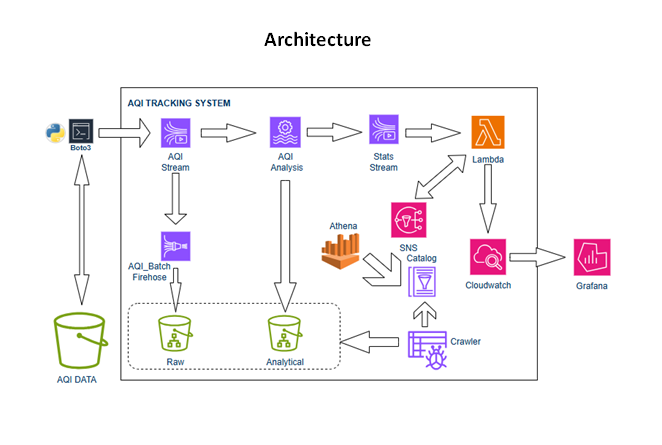

# AQI Tracking System.

Services Covered :

1. **S3 (Simple Storage Service)**: Object storage for scalable data storage.  
   *Use case*: Store and retrieve website assets like images and videos.  

2. **Kinesis Data Streams**: Real-time data streaming for high-throughput ingestion.  
   *Use case*: Process live clickstream data for real-time analytics.  

3. **Data Firehose**: Load streaming data into storage or analytics services.  
   *Use case*: Deliver IoT sensor data to S3 for batch processing.  

4. **Amazon Managed Service for Apache Flink**: Serverless stream processing.  
   *Use case*: Run real-time fraud detection on transaction streams.  

5. **Athena**: serverless, interactive query service.  
   *Use case*: Analyze log files stored in S3 without managing infrastructure.  

6. **Glue Crawler**: Automatically discover and catalog data.  
   *Use case*: Scan S3 datasets to populate the Glue Data Catalog.  

7. **Glue Catalog**: Central metadata repository for datasets.  
   *Use case*: Store table definitions for querying with Athena.  

8. **AWS Lambda**: Serverless compute for event-driven tasks.  
   *Use case*: Process file uploads to S3 by triggering a Lambda function.  

9. **CloudWatch**: Monitoring and observability for AWS resources.  
   *Use case*: Track Lambda execution metrics and set alarms.  

10. **Amazon Managed Grafana**: Visualize metrics and logs.  
    *Use case*: Create dashboards for monitoring application performance.

