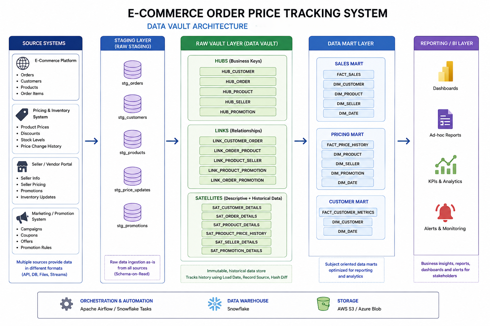

# E-Commerce Price Tracking System.

# Architecture :

# Data Vault Overview

Data Vault 2.0 is a detail-oriented, history-tracking, and highly scalable data modeling methodology designed to support enterprise data warehousing. Unlike traditional models, it separates business keys, relationships, and descriptive context into distinct tables to enable massive parallel loading and easy adaptation to changing business requirements.

# Core Table Types

- Hubs: Store unique business keys (e.g., Customer_ID). They represent core business concepts.

- Links: Store relationships or transactions between Hubs (e.g., Order_Placed linking Customer and Product).

- Satellites (Sats): Store descriptive attributes and history (e.g., Customer_Address, Product_Price). They connect to Hubs or Links and track changes over time.

- Data Vault vs. Dimensional Modeling Architecture: 

1. Data Vault serves as the raw integration layer (backend). Dimensional modeling is optimized for the reporting layer (frontend).

2. Flexibility: Data Vault allows adding new sources without altering existing tables. Dimensional models require rewriting tables or modifying existing facts and dimensions.

3. Dimensional modeling uses complex Slowly Changing Dimensions (SCD) types.

4. Loading Speed: Data Vault supports high-speed parallel loading because tables are decoupled. Dimensional modeling requires sequential loading to maintain foreign key integrity.