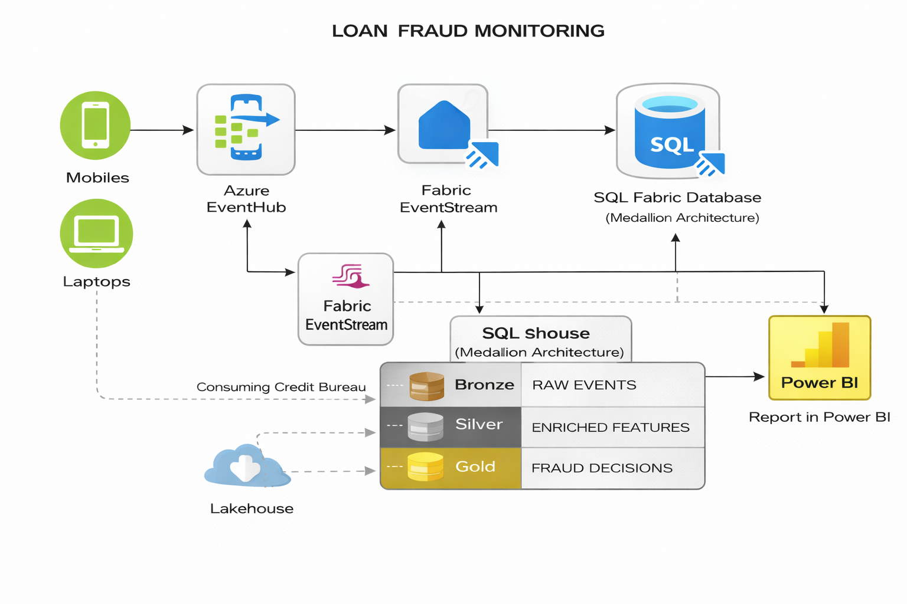

# Loan Fraud Monitoring 

# Scenario :
- Nowerdays banks gets the Applications for various types of loans(home,vehicle,personal,etc).
- Banks get this data at a realtime basis and they need to analyze the how many of the request are genuine and how many are fraud.
- Then create a report and present it to higher management for business actions.

# Architecture :

# Data Model :

