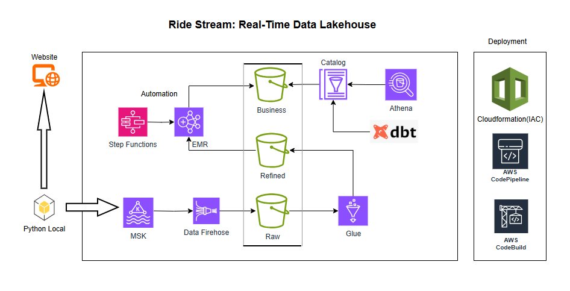

# Ride Stream Real-Time Data Lakehouse

# AWS Services used :

•	AWS Managed Service for Kafka
•	Data Firehose
•	S3
•	Glue
•	EMR
•	Step Functions
•	Glue Catalog
•	Athena
•	CloudFormation
•	AWS CodePipeline
•	AWS CodeBuild

# Purpose of the Project :

Designed and implemented an end-to-end data processing solution: ingested streaming data from MSK, utilized EMR for large-scale processing and enrichment based on specific business requirements, landed the refined data in Lakehose, and employed DBT for final data modeling to create a unified semantic layer, enabling comprehensive ad-hoc analysis.