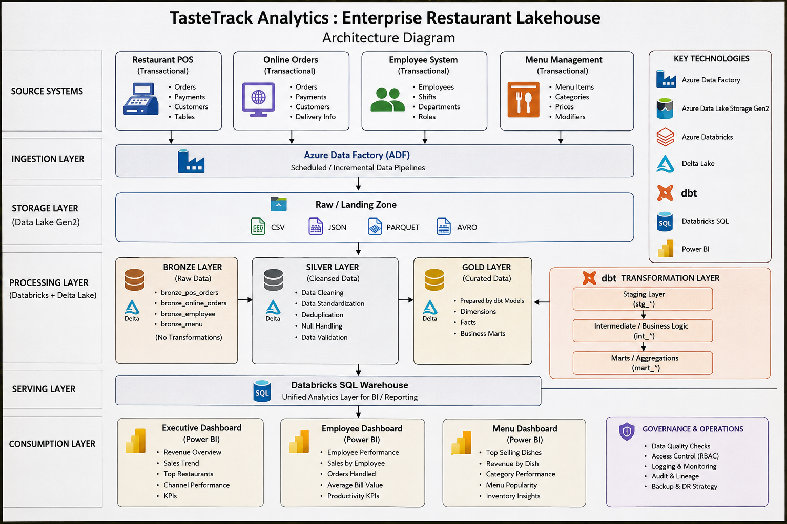

# Taste Track Analytics : Enterprise Restaurants Lakehouse.

# Architecture :

# What we will learn from this project :

- Azure SQL Database
- Azure Databricks
- Pyspark
- Delta Lake
- DBT
- PowerBI
- Data Modeling

Data Model Gold Layer :

# Report : 

